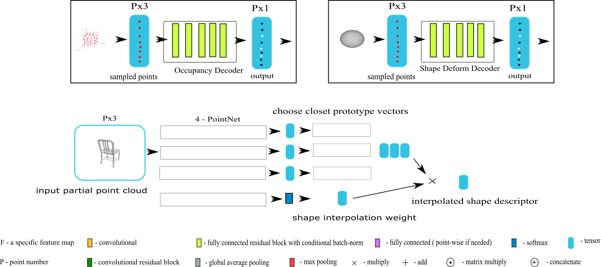

### Part Based Single View Shape Reconstruction
##### Project Goal
1. Verify the superiority of part based representation in shape reconstruction by proposing a novel neural network for the task.

2. The network should:
   
    - do reconstruction in few shot setting 
    
      

#### preliminary report 20190826

##### Done 

preliminary experiment on part-based shape augmentation:

##### To Do 

Hao's proposal

merge-net part-seg

open-context

shape - > super-pixel  -> predict merge score  

image -> part shape (limited visible area)

image -> merge-net -> part  seg -> part shape -> part arrangement -> shape completion

arrangement and shape completion 

shape refine-net by re-projection and compare to input image.

##### Report

The experiment is conducted as follows :

I picked  Chair, Storage Furniture, Table from PartNet 

I choose 1024 shapes from each category

I used parts from Chair and  Storage Furniture to randomly assemble 2048 shapes as a new category "Augment":

( more samples can be view at http://171.67.77.236:8082/_pon_aug )

I trained three different AtlasNet to do single view reconstruction:

NoAug:  trained with data from Chair and  Storage Furniture.

OnlyAug: trained with data from "Augment".

All: train with data from "Augment", Chair, Storage Furniture

These models are all validated with data from Table

Chamfer Distance  after 1024 epochs:

| CD    | NoAug        | OnlyAug  | All          |
| ----- | ------------ | -------- | ------------ |
| train | **0.005520** | 0.008278 | 0.005855     |
| val   | 0.035083     | 0.027681 | **0.020118** |

visual result: (go to the link for more visual results)

NoAug:  http://171.67.77.236:8082/_pon_atlas_noaug

OnlyAug:  http://171.67.77.236:8082/_pon_atlas_onlyaug

All:  http://171.67.77.236:8082/_pon_atlas_all

#### preliminary report 20190809

##### Done 
correctly run the test code of  [Learning to Reconstruct Shapes from Unseen Classes][5]

##### Report 

#### meeting 20190806 ( siyu & kaichun ) 

an important zero shot holistic baseline:  [Learning to Reconstruct Shapes from Unseen Classes][5]

tips for the few shot settings:
learn assembly from prototype
learn part generation / possible part relation from known category
    
#### preliminary report 20190805

A **proposal** as holistic baseline for few shot shape completion

The main references: (click the links to paper)
The few shot learning loss come from [Prototypical Networks for Few-shot Learning][4]

#### meeting 20190802 ( all )

What do we want to do ?

- [ ] reconstruct 3D shape from single image   (using part prior to assist it)
- [ ] recover object parts from single image for other applications like robot interaction planning (using reconstruction loss as regularization to assist it) 
- [x] few shot learning

#### preliminary report 20190719
##### Previous Attempts 

Under point cloud representation, Kaichun have tried 4 different approaches for the task ( including structurenet )
- When the generation of different part was assigned and trained by hungarian matching,  branches/tree nodes would compete to predict same part (generate duplicate parts), especailly if the point number for each part are fixed. The network reprensentation power maybe wasted in such case. This may even lead to the missing of other parts.

- In structurenet, the position shift of predicted parts may cause a large error in quantitative evaluation

##### Problem / Issue   
- By adopting part based representation, the challenge is shifted from shape prediction to structure prediction. It may not necessarily be a easier approach. Holistic approaches are allowed to learn arbitrary structure inside the space of the structures that they can implicitly represent as long as the loss is minimized. We attempt to learn semantic meaningful structure based on the PartNet annotation. Therefore, our part based approach may be more difficult to reach lower prediction error due to the extra constraint.

- To predict semantic meaningful structure, we would rely on the part annotation data from PartNet.  
=> It makes more sense to utilize **multi-level part annotation** as in structurenet instead of only certain level part annotation.   
=> However, how to utilize **multi-level part annotation** to train network for **cross category objects** remains a challenge for us.

##### To Do  
- to decide a new design of network as our new starting point. It should:

  - have structure prediction mechanism that can be trained with multi-level part annotation and for cross category objects.
  

if adopt occupancy representation:
- prepare data from PartNet for the training of Occupancy Network.
- port code and retrain Occupancy Network on our data as holistic baseline.

##### Report
A **proposal** by siyu is as follows:

The main references: (click the links to paper)
- The backbone network comes from [Occupancy Networks][1]
- The Gumbel Subset Sampling module is learned from [PAT][2]
- The part loss is inspired by [Single-Image Piece-wise Planar 3D Reconstruction via Associative Embedding][3]

A hypothesis behind the design regarding the key issue and the role of prior knowledge on object part:

 What is the key issue in previous holistic approaches ? 

unreasonable and inconsistent correlation / association / co-dependency is implicitly established inside neural networks.

For example, the shape variation of part is significantly smaller that shape variation of object, however, the networks can't automatically exploit such characteristic, because unnecessarily strong association may be established between different object part.  This will lead to unnecessary averaging effect.

What are the possible causes of this issue ? (we should avoid)

- network design:

  - the shape generation of each part depends only on single global shape descriptor

  - the assumption of  spherical homeomorphism

- training method & loss function:

  - using Hungarian matching to assign network branches for each part
  - Chamfer distance loss (correspondence based on nearest neighbor)

Why prior knowledge of object part is the cure for this issue ? (we should utilize)

- it can be used as GT to guide the network to learn an internal hierarchical part-by-part associations with proper and consistent strength

The network structure is as follows:

The part loss function:  
$$
L_{part}=L_{pull} + L_{push}
$$

$$
L_{pull} = \frac{1}{C_{part}}\sum\frac{1}{P_c}\sum max(||\mu_c - x_p||-\delta_v,0)
$$

$$
L_{push} = \frac{1}{C_{part}}\frac{1}{C_{part}}\sum\sum max(\delta_d - ||\mu_{cA} - \mu_{cB}||,0)
$$

The part loss aims at making the part feature similar to the mean feature for the points inside same part and making the mean part feature between different parts distinguishable from each other. The points outside the shape will be discarded.

In order to utilize multi-level part annotation, we split part feature into several group (divide channel into several group) and apply part loss on each group. If two points are in the same part across all level of part annotations, the entire part features should be close. If two points are only in the same part in top level part annotation, then only a fraction of their part features are close.

An illustration for expected effect of multi-level part loss is shown as follows:

[1]:https://arxiv.org/pdf/1812.03828.pdf "Occupancy Networks: Learning 3D Reconstruction in Function Space"

[2]:https://arxiv.org/pdf/1904.03375.pdf "Modeling Point Clouds with Self-Attention and Gumbel Subset Sampling"

[3]:https://arxiv.org/pdf/1902.09777.pdf "Single-Image Piece-wise Planar 3D Reconstruction via Associative Embedding"

[4]:https://arxiv.org/pdf/1703.05175.pdf "Prototypical Networks for Few-shot Learning"

[5]:http://genre.csail.mit.edu/papers/genre_nips.pdf "Learning to Reconstruct Shapes from Unseen Classes"
