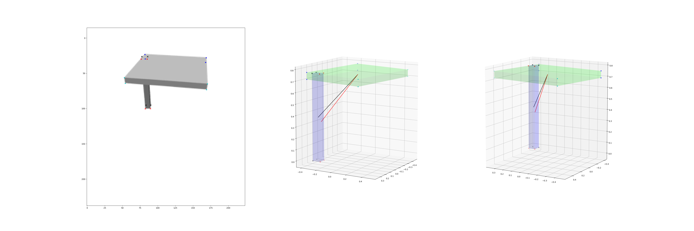

### Part Based Single View Shape Reconstruction
## Project Goal
1. Verify the superiority of part based representation in shape reconstruction by proposing a novel neural network for the task.

2. The network should:
   
    - do reconstruction in few shot setting 
    
    
    
    
    
    

#### report 202020110：

numeric evaluation:

https://docs.google.com/spreadsheets/d/1-svV9ZOxXlCRleoh-eA4XTf2leSLhkS_aXUbJ4s-ySc/edit?usp=sharing

visual result at: http://171.67.77.236:8082

notes:

report TF FN 

data re-generation for the masks

print model id in the visualization

occlusion ratio 

sample multiple points to calc chamfer distance

visualization with arbitrary

#### report 20200103：

issue:

the current reconstruction accuracy is not reasonable.

visual result at: http://171.67.77.236:8082

six rotation layer (existing code)

the table score is too low (more results needed to diagnose)

box pair visualization.

error in ground truth.

| 	   |   accuracy (touch or not)  |   L2 (1e-1) 	|
| :--- | ---- | ---- |
| Chair |   0.897126   |  4.032847  |
| Bag   |   0.588235   |  3.769608  |
| Bed	|	0.395007   |  3.722060	|
| Bottle|   0.695279   |  4.617071	|
| Bowl  |	0.945946   |  4.469102  |
| Clock  |	  0.423664 |  4.512960  |
| Dishwasher | 0.466667|  4.516269  |
| Display | 0.447853   |  4.083668  |
| Earphone|  0.303457  |  5.124140  |
| Faucet  | 0.298660   |  4.500903  |
| Hat 	  | 0.527027   |  4.637480  |
| Knife   |  0.575916  |  4.557213 |
| Lamp 	  |  0.350000  |  4.394330  |
| Laptop  | 0.370497   |  3.134173 |
| Microwave | 0.298444 |  3.986184 |
| Mug       | 0.737624  |  5.122827 |
| Storage	| 0.406495 | 4.274177 |
| Table     | 0.375298 | 4.350536 |
| TrashCan  | 0.469363 | 4.425459 |
| Vase | 0.631818 | 4.727471 |

#### meeting notes 20191227：

1. data preparation first

2. baselines:

   input just part image vs. input whole image ( expected result: part image is better in zero shot / whole image is better on seen  cases. is this true? ）

   

   holistic baseline:

   SDM-Net (part based) or structure-net

   GenRe (non-part based)

   

note : the comparison needs to clearly deliver the message on generalizability

more thinking: future works

how to correctly use the mask

middle level context / hierarchy context

Done: 

implemented and debugged on one mini-batch

#### meeting notes 20191219:

In todays' meeting we agreed on a more clear technique proposal:

a. given a pre-defined part relationship vocabulary;

b. input an object image and part mask

we output:

1) for each part, we predict a box (size and rotation) as its 3d representation

2) in the input image, for each pair of part

predicting their relation category and corresponding parameters;

*) we assemble the boxes with the predicted relationship (greedy assemble first)

c. we want to check if such image-grounded prediction network can be better generalized to novel category e.g. from chair to table.

#### Report 20191213

Done :

visualization with Beta-VAE:

the settings:

bottleneck size / latent size = 8

input  representation vector of 2 boxes with center(x,y,z) (3) size (l,w,h) (3) rotation (6) (first two row of the rotation matrix )

ie. 12 dimension for each boxes

with L2 as reconstruction loss

beta = 100 as weight for KL loss

the condition vector removes 9 dimension from the second boxes 

the following images show one picked meaningful case in which the 7th dim learns one meaningful relation of the two bars from the chair category 

in a lot of cases, I couldn't figure out the meaning of the latent dimensions

To Do: 

working on the  binary latent space, expecting to discover more discrete relation space

### visualize 20191128:

VAE

binary bottleneck network to discover the relation

18 dim concatenate box representation to represent relation and reduce dim for the relation distribution

### update 20191119:

 Thoughts on Human 3d perception  mechanism :

Based on some observation, now I believe the human monocular static 3d perception is path related.

human will choose "more reliable" path to aggregate local information to draw a global conclusion.

the proposed pipeline:

however, the previous experiments was based on the wildly generated boxes, therefore no success yet.

 

##### Human Study :

conclusion:

 the ambiguity is too large in the wildly generated boxes dataset 

the study conducted at:

http://171.67.77.236:8082/study

statistic result for human study  can be viewed at:

http://171.67.77.236:8082/studyres/000

dA - dB > 0 mean A is closer 

dA - dB < 0 means B is closer

in this example 

5 people select A 

18 people select B

##### Go Back to Small Training Set :

train on mini dataset with box regression from (Chair Category)

training dataset result can easily overfit (entire image and 2D masks for two boxes are inputed to neural network)：

results on test set: (boxes regressed from Table Category): it can generalize in some degree

### report 20191018:

#### diagnosing:

a. hard sigmoid vs sigmoid

2. why outer products ?

assume row vector

the experiment learning 
$$
f:M \rightarrow (\theta,\varphi)
$$

$$
M = [x_{s1},y_{s1},z_{s1},\cdots,x_{s8},y_{s8},z_{s8}]^T[x_{t1},y_{t1},z_{t1},\cdots,x_{t8},y_{t8},z_{t8}]
$$

$$
v_1^Tv_2 = (2v_1)^T(\frac{1}{2}v_2)
$$
it may conflict 

concatenate vs. outer product

3. continue to train

### report 20191017:

##### Done  

a new toy set:

the new toy data set generated by fit bounding box from part net 

the training set  comes from chair

the test set comes from table

the corner fit experiment:

vectorizing 2D coordinates and using outer product to generate 256 dim feature 

using MLP(256,128) ->(128,64)->(64,32)->(32,2)

### report 20191009：

##### Done  

on open set arrangement learning

I implemented a rule based box placement to generate toy data for exp

 the underline rules:

1. there are five different kind of boxes in the world.

2. box with smaller base must place on top of one with larger base

3. otherwise place box on the ground without interaction

4. the cube never appears in the training data

   

   currently only two boxes are chosen

   

On Part generation 

I fixed some bugs and understand more of the data from Kai Chun.

there will be new results on part generation tomorrow on our project meeting.

http://171.67.77.236:8082/partgen-mini

how about cage based representation

To Do 

Implementing a conditional GAN to generate scale and arrangement to place the boxes. 

to find out what kind of knowledge are easily generalized and what are not.

### meeting notes 20191004:

**motivation and priority** 

We believe that to accomplish open-set single view reconstruction, the shape regression neural networks, no matter with what kind of shape representation, are all dead ends. 

A more promising approach is to mimic human behavior to construct objects in three steps: 

a) parse the object into parts from visual input. (part segmentation)

b) forge the primitive material into object parts, one by one. (part generation)

c) conditioned on the visual input, assemble the parts into reasonable configuration. (assemble)

Now, our priority is focused on step c):

For step c),  we employ the framework of generative adversarial network and propose an

Assembler-VAE-GAN.

For Assembler - VAE - GAN, 

We first train a VAE to encode part assembling image into vector z.

Then we train GAN for assembling

The **generator** is conditioned on two self centered parts (as two point sets), it output two 3D transformations, which are used to transform the parts to be attached. 

random input vector z is sampled based on input image or randomly draw from distribution.

one **discriminator** takes two transformed parts as input and output whether they are  in reasonable configuration.

another  **discriminator**  takes the image of part assembling and the merged point cloud as input to tell whether they are matched.

The **advantage** of such design is that inference can function with or without the visual input, hence have the  potential to complete the invisible part based purely on the distribution of reasonable configuration.

### report 20191004

##### Done  

some ugly results

http://171.67.77.236:8082/bv/data~res~_pgen~_000_as

current cd 0.011

should reach somewhere about 0.006 ( or even smaller considering we are doing only the parts? ) 

##### To Do 

how to make our method iteration  faster ( smaller dataset doesn't work )

data preparation

1. the view - gt alignment issue

   

#### meeting 20190927 ( kaichun, tiange & siyu  ) 

##### To Do 

complete first version of step 2 and step 3.

part construction.

place shape according to mask ray.

#### meeting 20190826 ( hao, kaichun & siyu ) 

##### Done 

preliminary experiment on part-based shape augmentation:

##### To Do 

Hao's proposal

merge-net part-seg

open-context

shape - > super-pixel  -> predict merge score  

image -> part shape (limited visible area)

image -> merge-net -> part  seg -> part shape -> part arrangement -> shape completion

arrangement and shape completion 

shape refine-net by re-projection and compare to input image.

##### Report

The experiment is conducted as follows :

I picked  Chair, Storage Furniture, Table from PartNet 

I choose 1024 shapes from each category

I used parts from Chair and  Storage Furniture to randomly assemble 2048 shapes as a new category "Augment":

( more samples can be view at http://171.67.77.236:8082/_pon_aug )

I trained three different AtlasNet to do single view reconstruction:

NoAug:  trained with data from Chair and  Storage Furniture.

OnlyAug: trained with data from "Augment".

All: train with data from "Augment", Chair, Storage Furniture

These models are all validated with data from Table

Chamfer Distance  after 1024 epochs:

| CD    | NoAug        | OnlyAug  | All          |
| ----- | ------------ | -------- | ------------ |
| train | **0.005520** | 0.008278 | 0.005855     |
| val   | 0.035083     | 0.027681 | **0.020118** |

visual result: (go to the link for more visual results)

NoAug:  http://171.67.77.236:8082/_pon_atlas_noaug

OnlyAug:  http://171.67.77.236:8082/_pon_atlas_onlyaug

All:  http://171.67.77.236:8082/_pon_atlas_all

#### preliminary report 20190809

##### Done 
correctly run the test code of  [Learning to Reconstruct Shapes from Unseen Classes][5]

##### Report 

#### meeting 20190806 ( siyu & kaichun ) 

an important zero shot holistic baseline:  [Learning to Reconstruct Shapes from Unseen Classes][5]

tips for the few shot settings:
learn assembly from prototype
learn part generation / possible part relation from known category
    
#### preliminary report 20190805

A **proposal** as holistic baseline for few shot shape completion

The main references: (click the links to paper)
The few shot learning loss come from [Prototypical Networks for Few-shot Learning][4]

#### meeting 20190802 ( all )

What do we want to do ?

- [ ] reconstruct 3D shape from single image   (using part prior to assist it)
- [ ] recover object parts from single image for other applications like robot interaction planning (using reconstruction loss as regularization to assist it) 
- [x] few shot learning

#### preliminary report 20190719
##### Previous Attempts 

Under point cloud representation, Kaichun have tried 4 different approaches for the task ( including structurenet )
- When the generation of different part was assigned and trained by hungarian matching,  branches/tree nodes would compete to predict same part (generate duplicate parts), especailly if the point number for each part are fixed. The network reprensentation power maybe wasted in such case. This may even lead to the missing of other parts.

- In structurenet, the position shift of predicted parts may cause a large error in quantitative evaluation

##### Problem / Issue   
- By adopting part based representation, the challenge is shifted from shape prediction to structure prediction. It may not necessarily be a easier approach. Holistic approaches are allowed to learn arbitrary structure inside the space of the structures that they can implicitly represent as long as the loss is minimized. We attempt to learn semantic meaningful structure based on the PartNet annotation. Therefore, our part based approach may be more difficult to reach lower prediction error due to the extra constraint.

- To predict semantic meaningful structure, we would rely on the part annotation data from PartNet.  
=> It makes more sense to utilize **multi-level part annotation** as in structurenet instead of only certain level part annotation.   
=> However, how to utilize **multi-level part annotation** to train network for **cross category objects** remains a challenge for us.

##### To Do  
- to decide a new design of network as our new starting point. It should:

  - have structure prediction mechanism that can be trained with multi-level part annotation and for cross category objects.
  

if adopt occupancy representation:
- prepare data from PartNet for the training of Occupancy Network.
- port code and retrain Occupancy Network on our data as holistic baseline.

##### Report
A **proposal** by siyu is as follows:

The main references: (click the links to paper)
- The backbone network comes from [Occupancy Networks][1]
- The Gumbel Subset Sampling module is learned from [PAT][2]
- The part loss is inspired by [Single-Image Piece-wise Planar 3D Reconstruction via Associative Embedding][3]

A hypothesis behind the design regarding the key issue and the role of prior knowledge on object part:

 What is the key issue in previous holistic approaches ? 

unreasonable and inconsistent correlation / association / co-dependency is implicitly established inside neural networks.

For example, the shape variation of part is significantly smaller that shape variation of object, however, the networks can't automatically exploit such characteristic, because unnecessarily strong association may be established between different object part.  This will lead to unnecessary averaging effect.

What are the possible causes of this issue ? (we should avoid)

- network design:

  - the shape generation of each part depends only on single global shape descriptor

  - the assumption of  spherical homeomorphism

- training method & loss function:

  - using Hungarian matching to assign network branches for each part
  - Chamfer distance loss (correspondence based on nearest neighbor)

Why prior knowledge of object part is the cure for this issue ? (we should utilize)

- it can be used as GT to guide the network to learn an internal hierarchical part-by-part associations with proper and consistent strength

The network structure is as follows:

The part loss function:  
$$
L_{part}=L_{pull} + L_{push}
$$

$$
L_{pull} = \frac{1}{C_{part}}\sum\frac{1}{P_c}\sum max(||\mu_c - x_p||-\delta_v,0)
$$

$$
L_{push} = \frac{1}{C_{part}}\frac{1}{C_{part}}\sum\sum max(\delta_d - ||\mu_{cA} - \mu_{cB}||,0)
$$

The part loss aims at making the part feature similar to the mean feature for the points inside same part and making the mean part feature between different parts distinguishable from each other. The points outside the shape will be discarded.

In order to utilize multi-level part annotation, we split part feature into several group (divide channel into several group) and apply part loss on each group. If two points are in the same part across all level of part annotations, the entire part features should be close. If two points are only in the same part in top level part annotation, then only a fraction of their part features are close.

An illustration for expected effect of multi-level part loss is shown as follows:

[1]:https://arxiv.org/pdf/1812.03828.pdf "Occupancy Networks: Learning 3D Reconstruction in Function Space"

[2]:https://arxiv.org/pdf/1904.03375.pdf "Modeling Point Clouds with Self-Attention and Gumbel Subset Sampling"

[3]:https://arxiv.org/pdf/1902.09777.pdf "Single-Image Piece-wise Planar 3D Reconstruction via Associative Embedding"

[4]:https://arxiv.org/pdf/1703.05175.pdf "Prototypical Networks for Few-shot Learning"

[5]:http://genre.csail.mit.edu/papers/genre_nips.pdf "Learning to Reconstruct Shapes from Unseen Classes"
